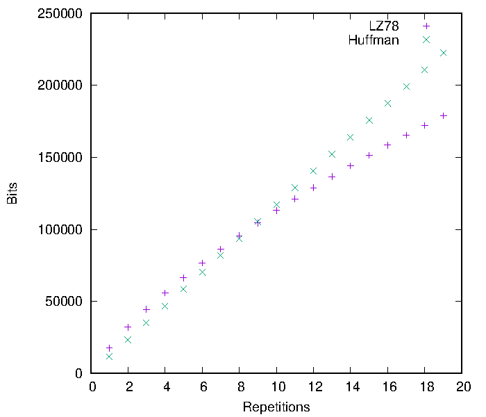

# Description

Small tool to compare Huffman and LZ78 compression ratio.

# Requirements

[libdivsufsort](https://github.com/y-256/libdivsufsort)

# Usage

```
sh plot.sh INPUT_FILEPATH [OUTPUT_FILEPATH=stdout, MODE=utf-8]
```
Example: 

```
sh plot.sh data/des-que-le-vents-soufflera.txt out/des-que-les-vents-soufflera.ps
```



```
sh with_btw.sh INPUT_FILEPATH [OUTPUT_FILEPATH=stdout, MODE=utf-8, LIB_DIVSUFSORT_PATH=""]
```

Example: 

```
sh with_btw.sh data/moby-dick.txt out/moby-dick.wbwt ascii
```

# Discussion

The divsufsort library handles ASCII characters only. The with_btw sript does not work with utf-8 documents.


